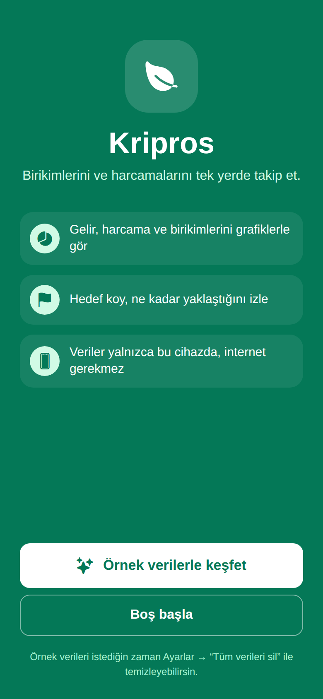
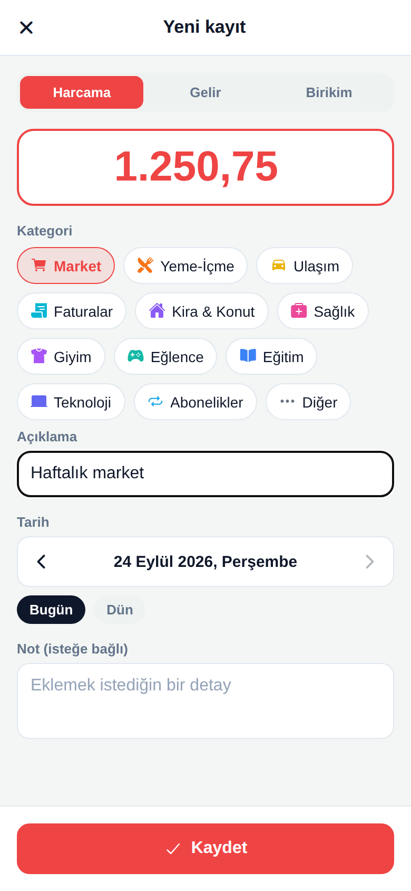

# Kripros

Birikimlerini, harcamalarını ve gelirini tek yerde takip eden bir mobil uygulama (Expo / React Native). Sunucu yok, hesap yok: tüm veriler cihazda saklanır ve uygulama internetsiz çalışır.

| Karşılama | Özet | Takvim | Hedefler | Yeni kayıt |
|---|---|---|---|---|
|  |  |  |  |  |

## Özellikler

- **Gelir, harcama ve birikim kayıtları**, düzenlenebilir kategorilerle.
- **Birikim alışkanlıkları**: "Kahve almadım · 85 ₺ · günlük" gibi tekrar eden tasarruflar. Zamanı gelenler ana sayfada ve takvimde öneri olarak çıkar, tek dokunuşla eklenir.
- **Grafikler**: son 7 gün / 5 hafta / 12 ay için gelir, harcama ve birikimi yan yana gösteren çubuk grafik. Aylık dağılım için halka grafik. İkisi de kütüphanesiz, doğrudan SVG ile çizilir.
- **Takvim**: her günün harcama ve birikim toplamları; bir güne dokununca o günün kayıtları.
- **Hedefler**: "Yaz tatili 40.000 ₺" gibi hedefler. İlerleme, kalan tutar ve hedef tarihine yetişmek için gereken aylık tutar.
- **Geçmiş**: günlere göre gruplu, aranabilir ve türe göre filtrelenebilir liste.
- **Türkçe tutar girişi**: `45,50`, `1.250`, `1.250,75` gibi yazımlar doğru okunur. Toplamlar kuruş hassasiyetinde, kayan nokta hatası olmadan hesaplanır.
- **İlk açılışta seçim**: boş başlamak ya da birkaç aylık örnek veriyle uygulamayı keşfetmek.

## Çalıştırma

```bash
npm install
npx expo start          # telefonda Expo Go ile QR kodu okut
npx expo start --web    # tarayıcıda
```

## Testler ve kontroller

```bash
npm test               # Jest birim testleri
npm run lint           # ESLint
npm run check:bundle   # Android JS paketinin derlendiğini doğrular
```

## Teknik notlar

- **Expo SDK 53, React Native 0.79 (New Architecture), React 19**. Aynı kod Android, iOS ve web'de çalışır.
- **Veri katmanı** (`src/store/`): kayıtlar bellekte tutulur ve AsyncStorage'a yazılır.
  - Aynı anda yapılan değişiklikler tek bir yazma işleminde birleştirilir.
  - Büyük tablolar 16 parçaya bölünür; böylece Android'deki tek kayıt başına ~2 MB sınırına takılmaz ve yalnızca değişen parça yeniden yazılır.
- **Hesaplamalar** (`src/domain/`): istatistikler, öneri algoritması ve hedef ilerlemesi arayüzden bağımsız, saf fonksiyonlardır ve birim testleriyle kapsanır.
- **Tarihler** `YYYY-MM-DD` biçiminde, yerel gün olarak saklanır. Böylece saat dilimi yüzünden kayıtlar yanlış güne kaymaz.
- **Pencereler** tek bir `Modal` içinde yığın olarak açılır. iOS'ta iç içe birden fazla `Modal` açmak güvenilir çalışmadığı için bu yol seçildi; alttaki pencerenin form durumu da korunur.

## Proje yapısı

```
App.js              giriş noktası: veri → karşılama ya da ana ekran
src/
  store/            cihazdaki veri deposu (AsyncStorage)
  state/            DataContext: veriler ve işlemler
  domain/           istatistikler, öneriler, varsayılan/örnek veriler, doğrulama
  lib/              tutar ve tarih yardımcıları, diyaloglar
  navigation/       sekmeler ve pencere yığını
  screens/          Özet, Takvim, Hedefler, Geçmiş, Karşılama
  sheets/           Kayıt, Gün, Hedef, Ayarlar, Kategoriler, Alışkanlıklar pencereleri
  components/       ortak arayüz parçaları ve SVG grafikler
docs/screenshots/   README görselleri
```
