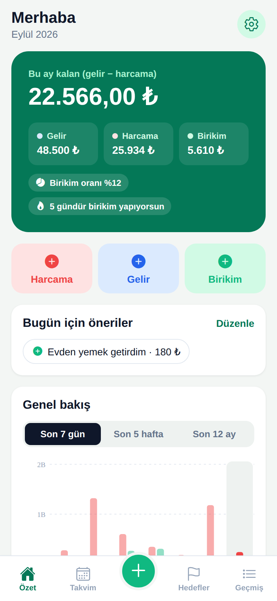
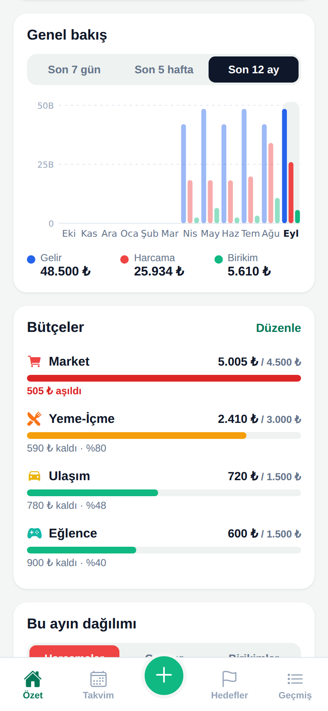
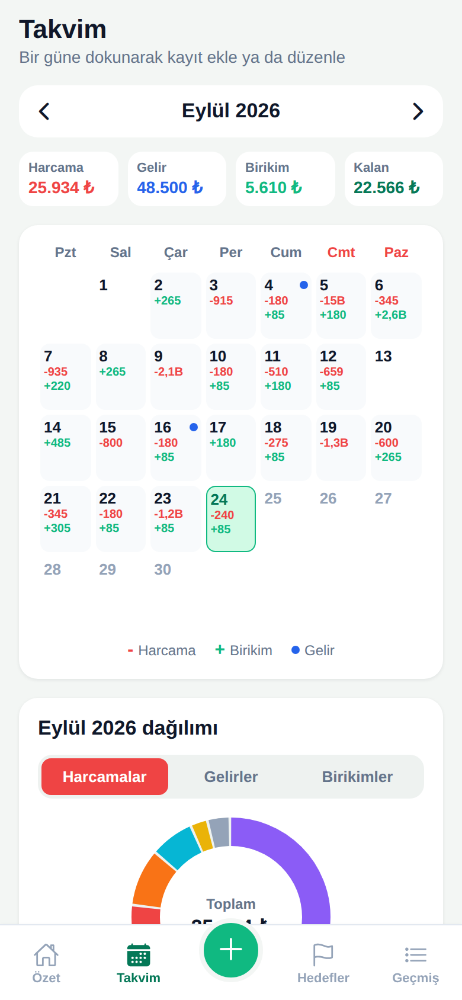
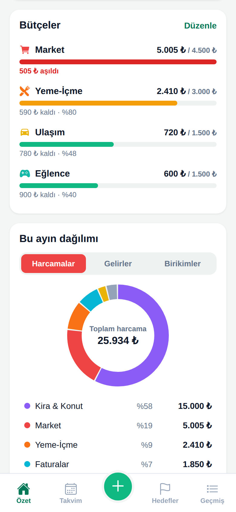
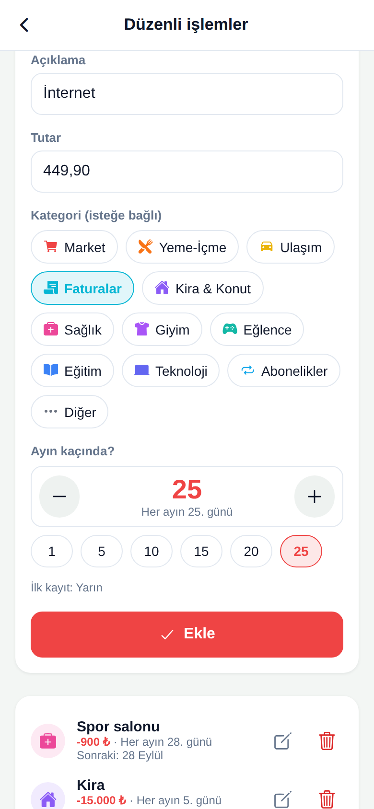
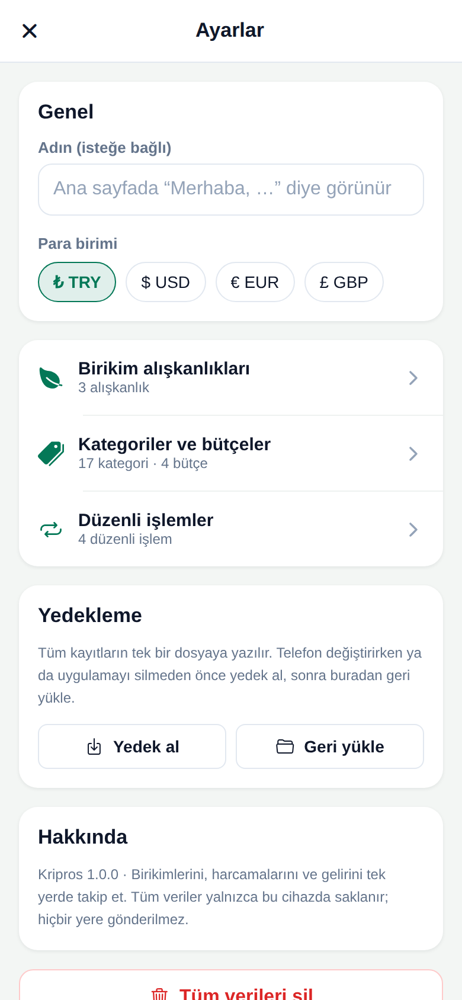
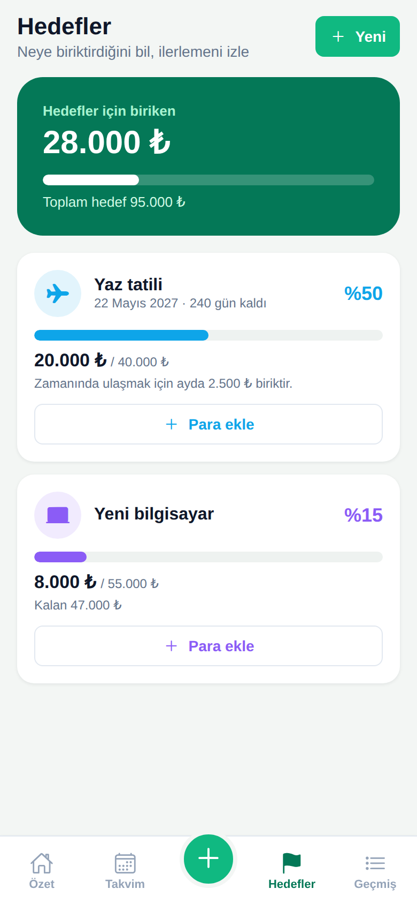
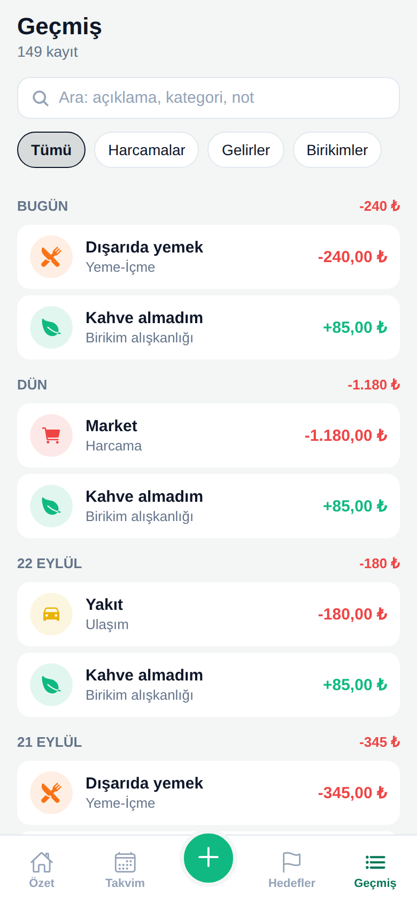
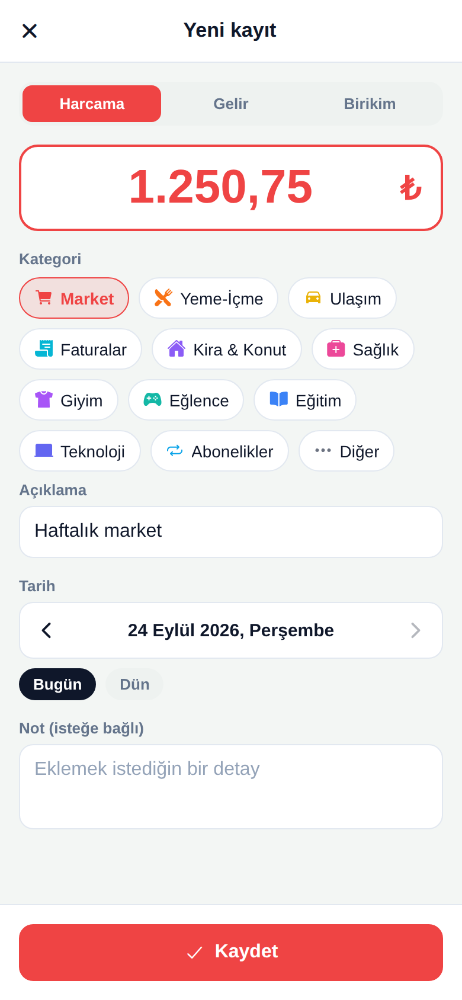

<div align="center">


# Kripros

A personal finance tracker for savings, spending and income, built with Expo and React Native.<br>
It runs fully on the device: no account, no server, no internet needed.

**[Live demo](https://mustafaaltuntas.com/kripros/)** · [Türkçe](README.tr.md)

[](https://github.com/r9xdty/kripros/actions/workflows/ci.yml)


[](LICENSE)

</div>

| Overview | Charts | Calendar |
|:---:|:---:|:---:|
|  |  |  |
| **Budgets** | **Recurring** | **Backup & settings** |
|  |  |  |
| **Goals** | **History** | **New record** |
|  |  |  |

> The interface is in Turkish. In the live demo, choose **“Örnek verilerle keşfet”** to start with a few months of sample data.

## Features

- **Income, spending and savings** with editable categories.
- **Budgets**: a monthly limit for any spending category. The overview shows how much of each budget is used, and a notice appears when a new spending passes 80% or the limit.
- **Recurring income and spending**: salary, rent or subscriptions are set up once (“every month on the 5th”) and recorded automatically when the day comes, even if the app was closed for a while. The next ones are listed on the overview.
- **Backups**: all records are exported to a single JSON file and can be restored on another phone, or from the welcome screen after a reinstall.
- **Saving habits**: recurring savings such as “skipped coffee · ₺85 · daily”. Habits that are due are suggested on the overview and in the calendar, and can be added with one tap.
- **Charts**: a grouped bar chart comparing income, spending and savings over the last 7 days, 5 weeks or 12 months, and a donut chart of the month by category. Both are drawn directly with SVG, without a chart library.
- **Calendar**: daily totals at a glance; tap a day to see or add its records.
- **Goals**: targets like “summer holiday ₺40,000”, with progress, the amount left and the monthly amount needed to reach it on time.
- **History**: records grouped by day, searchable and filterable by type.
- **Insights**: this month's spending compared with the same days of last month, the savings rate and the saving streak.
- **Turkish number input**: `45,50`, `1.250` and `1.250,75` are all read correctly. Totals are computed in kuruş (cents), so there are no floating-point errors.

## Getting started

```bash
npm install
npx expo start          # scan the QR code with Expo Go
npx expo start --web    # or open it in the browser
```

## Scripts

| Command | What it does |
|---|---|
| `npm test` | Jest unit tests |
| `npm run lint` | ESLint (Expo config) |
| `npm run check:bundle` | Checks that the Android JS bundle builds |

Every push and pull request runs lint, tests and a web build on GitHub Actions. Pushes to `main` also deploy the web build to GitHub Pages.

## How it works

- **Expo SDK 53, React Native 0.79 (New Architecture), React 19**: one codebase for Android, iOS and the web.
- **Local store** (`src/store`): records are kept in memory for the UI and saved to AsyncStorage.
  - Changes made at the same time are written in a single call.
  - Large tables are split into 16 buckets, so no value hits Android's ~2 MB per-item limit and only the changed bucket is rewritten.
- **Domain logic** (`src/domain`): statistics, budgets, recurring rules, backups, the habit suggestions and goal progress are plain functions, independent of the UI and covered by unit tests.
- **Recurring rules** keep the date of their next occurrence. When the app starts or comes back to the foreground, occurrences that are due are recorded and the rule moves on a month. The 31st becomes the last day of shorter months, and changing a rule's day never records the same month twice.
- **Backups** are checked completely (format, version, every record) before anything on the device is replaced.
- **Dates** are stored as local calendar days (`YYYY-MM-DD`), so a record never moves to another day because of time zones.
- **Sheets**: forms and details open as a stack inside a single `Modal`. Nesting several React Native modals is unreliable on iOS; this way the form under the top sheet also keeps its state.

## Project structure

```
App.js              entry point: data provider → welcome screen or main app
app.json            Expo configuration
app.config.js       adds the GitHub Pages base path to web builds in CI
src/
  store/            on-device store (AsyncStorage)
  state/            DataContext: data and actions for the screens
  domain/           statistics, budgets, recurring rules, backups, suggestions,
                    validation, default and sample data
  lib/              money and date helpers, dialogs, ids, saving/opening files
  navigation/       tab bar and sheet stack
  screens/          Overview, Calendar, Goals, History, Welcome
  sheets/           record, day, goal, settings, categories, habits and recurring
  components/       shared UI parts and the SVG charts
docs/screenshots/   images used in this README
.github/workflows/  CI and GitHub Pages deployment
```

## License

[MIT](LICENSE)
